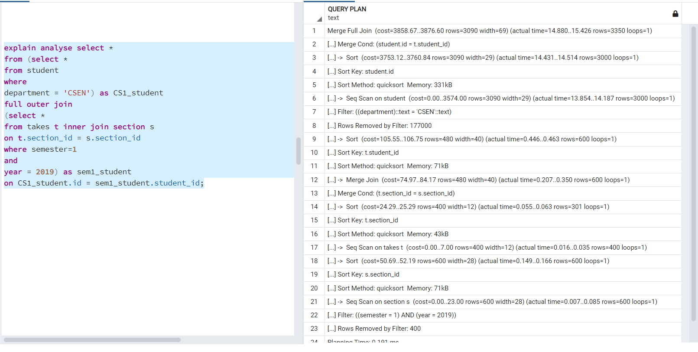
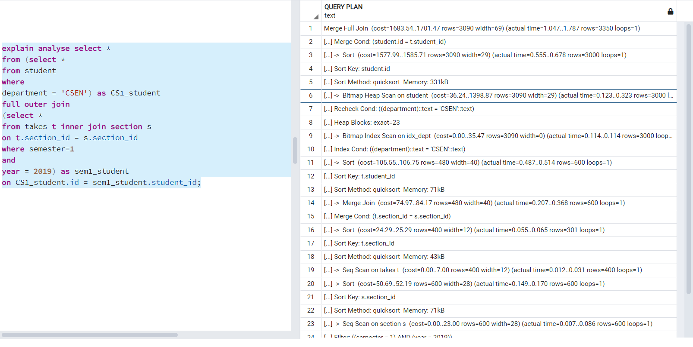
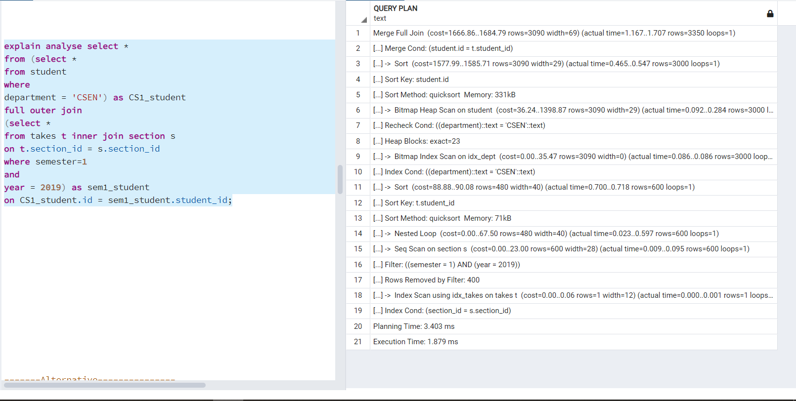

## Query 1

* Display a list of all students in the CSEN department, along with the course sections, if any, that they
have taken in Semester 1 2019; all course sections from Spring 2019 must be displayed, even if no
student from the CSEN department has taken the course section.

### Original Query

```
select *
from (select *
from student
where
department = 'CSEN') as CS1_student
full outer join
(select *
from takes t inner join section s
on t.section_id = s.section_id
where semester = 1
and
year = 2019) as sem1_student
on CS1_student.id = sem1_student.student_id; 

```

## Initial Configuration


- The 3 primary key constraints from tables student, section and takes were dropped as to be able to test the query cost and plan of any queries with no indexes correctly without the interfence of the default btree index that gets created on the primary keys. 

- Bitmapscan was turned on to hint postgres to use index scan and not seq scan. Disabling seqscan wasn't useful in my case as the cost of queries with indices while having seqscan off was approximately 10^6 times worse than the query cost without any index and that may have occured due to my laptop gaming specs and the usage of SSD instead of HDD.

- Also, Hash Join and Hash Aggregate flags were disabled as after many trials and errors , I've discovered this is best way to show the difference in terms of the cost and to beat the Postgres Query
Optimizer Algorithm to be able to show indices effect and cost differences.


#### Result Set

* 3350 rows


#### Report

1) given query without an index




##### Explanation :
  * Metrics :
  
      | Execution Time : 15.573 ms | Total Expected Cost : 3876.60 |
      |----------------------------|-------------------------------|

- The cost reported above was the result of postgres of performing seq scan on all tables (student, section & takes) to get all corresponding and matching tuples from each, in addition to using merge algorithm to perform the join operation between section and takes tables.


2) given query with B+ trees indices only





##### Explanation :
  * Metrics :
  
      | Execution Time : 2.036 ms | Total Expected Cost : 1701.47 |
      |----------------------------|-------------------------------|

- Btree indices were created on the following columns: (id , department) in table student, (section_id, semester, year) in table section & (section_id) in table takes.
 - We can see here that the cost along with the execution time have reduced significantly compared to no index usage and that's due to the index scan being performed on table student while looking for the CSEN department.

 - Searching for the CSEN departments took O(log n) where n is the number of tuples in student table instead of O(n). Table student had 180k rows in it so searching linearly definitely had a set back on performance and searching using Btree helped very much to boost performance and retrieve needed tuples much faster.


3) given query with hash indices only

 


##### Explanation :
  * Metrics :
  
      | Execution Time : 2.124 ms | Total Expected Cost : 1748.50 |
      |----------------------------|-------------------------------|

- Hash indices were created on the following columns: (id , department) in table student, (section_id, semester, year) in table section & (section_id) in table takes.
 - We can see here that the cost along with the execution time have reduced significantly compared to no index usage and that's due to the index scan being performed on table student while looking for the CSEN department.
 - We can notice that the cost of performing hash indexing was slightly higher than the cost of performing BTree even though hashing is done in O(1) ,which might have been due to the execution of a nested loop while returning the data results at the 14th statement in the image above which wasn't present in Btree's query plan.


4) given query with BRIN indices only

 
 
 

##### Explanation :
* Metrics :

| Execution Time : 2.109 ms | Total Expected Cost : 2056.02 |
|----------------------------|-------------------------------|

- BRIN indices were created on the following columns: semester in table section and department in table student.
 - The cost here is also much smaller than the query without any index as the search time has been reduced due to having not much unique values in both columns since there exists only 60 distinct departments in table student and only 2 values for semester either 1 or 2 and data is sorted on both columns by my insertion code so BRIN knows exactly when to start and end by the min and max that it stores of each page.


5) given query with mixed indices (any mix of your choice).

 


##### Explanation :
* Metrics :

| Execution Time : 1.879 ms | Total Expected Cost : 1684.79 |
|----------------------------|-------------------------------|

- Btree was created on the following columns: (department, id) in table student.
Hash indices were created on the following columns: (section_id, year) in table section and (section_id) in table takes.
Brin index was created on column semester in section table.

- It's noticed here that the execution time and estimated cost is the BEST so far among all other previous queries and that's what should be expected as taking the best index for each column results in a decent performance boost.


### Optimized Query

```
CREATE MATERIALIZED VIEW stud
 AS
 select * from student
 where
 department = 'CSEN'
 WITH DATA;


 create MATERIALIZED VIEW sec_Take
 AS
 select t.student_id,t.section_id,t.grade,s.semester,s.year,s.instructor_id,s.course_id,s.classroom_building,
 s.classroom_room_no
 from takes t inner join section s
 on t.section_id = s.section_id
 where s.semester=1 and s.year = 2019
 WITH DATA;


 CREATE MATERIALIZED VIEW sec_Take2
 AS
 select t.student_id,t.section_id,t.grade,s.semester,s.year,s.instructor_id,s.course_id,s.classroom_building,
 s.classroom_room_no
 from takes t right outer join section s
 on t.section_id = s.section_id
 where semester=2 and year=2019
 WITH DATA;


 explain analyse
 Select * From stud left outer join sec_Take ON stud.id=sec_Take.student_id
 UNION 
 ( 
 Select *
 from stud right outer join
 (select t.student_id,t.section_id,t.grade,s.semester,s.year,s.instructor_id,s.course_id,s.classroom_building,
 s.classroom_room_no
 from takes t right outer join section s
 on t.section_id = s.section_id
 where semester=2 and year=2019) as sec2
 ON stud.id=sec2.student_id
 )

```

#### Report

1) given query without an index

   

 


##### Explanation :
* Metrics :

| Execution Time : 5.385 ms | Total Expected Cost : 993.70 |
|----------------------------|-------------------------------|

- Please note that the original query was missing course sections from spring 2019, which I've added and that resulted in a bigger result set of course than the original, which makes that comparsion a little Unfair. 
Yet, I've managed even with the increase in the result set to reduce the cost size compared to the original query with no indexing. 
- Cost have dropped from 3876 to 993 by the use of materialized views whose costs aren't added during the execution of the query as they are only created once and become ready afterwards to be used in the queries, so many of the filtrations and joins were made in them which made the original query much more efficient as the tables it needs are already present.
- The same configurations as the original query still hold.

1) given query with B+ trees indices only,


 
 


##### Explanation :
* Metrics :

| Execution Time : 5.538 ms | Total Expected Cost : 991.95 |
|----------------------------|-------------------------------|

- The cost here have changed slightly as compared to no indices dropping from 993 to 991.
- The small drop in cost that happened was due to the Bitmap Heap Scan that was done on table section and the bitmap index scan on the index on the semester column instead of traversing and searching in table section sequentially. Improvement was somehow limited as postgres chose not to use index on department column as well as section_id on takes table and did a seq scan instead.


3) given query with hash indices only

 
 
 


##### Explanation :
* Metrics :

| Execution Time : 5.445 ms | Total Expected Cost : 983.92 |
|----------------------------|-------------------------------|

- It is noticed here that the cost have been slightly reduced by the usage of hash indices compared to no indices at all as instead of doing a seq scan to find a particular section id while doing the join, an index scan on table takes was used which caused that boost.  

- Here as expected, hash index with its O(1) performance beats Btree indices, as hashing is best for exact queries.

4) given query with BRIN indices only


 
 


##### Explanation :
* Metrics :

| Execution Time : 5.113 ms | Total Expected Cost : 993.70 |
|----------------------------|-------------------------------|

- The cost here is almost the same and the brin didn't have any effect on the performance of the query.
- This is due to the bitmap index scan not being chosen by postgres but a seq scan instead even though bitmap scan is enabled as it doesn't detect the query as a low selectivity one so brin is not favoured.

5) given query with mixed indices (any mix of your choice)


 
 


##### Explanation :
* Metrics :

| Execution Time : 5.302 ms | Total Expected Cost : 982.17 |
|----------------------------|-------------------------------|

- The cost here is the best among all other previous queries due to using both hash and btree indices on the columns where they fit best.
- The btree index didn't enhance it as much as hash index enhanced it for the same reason mentioned above about btree not enhancing the cost quite as much.

