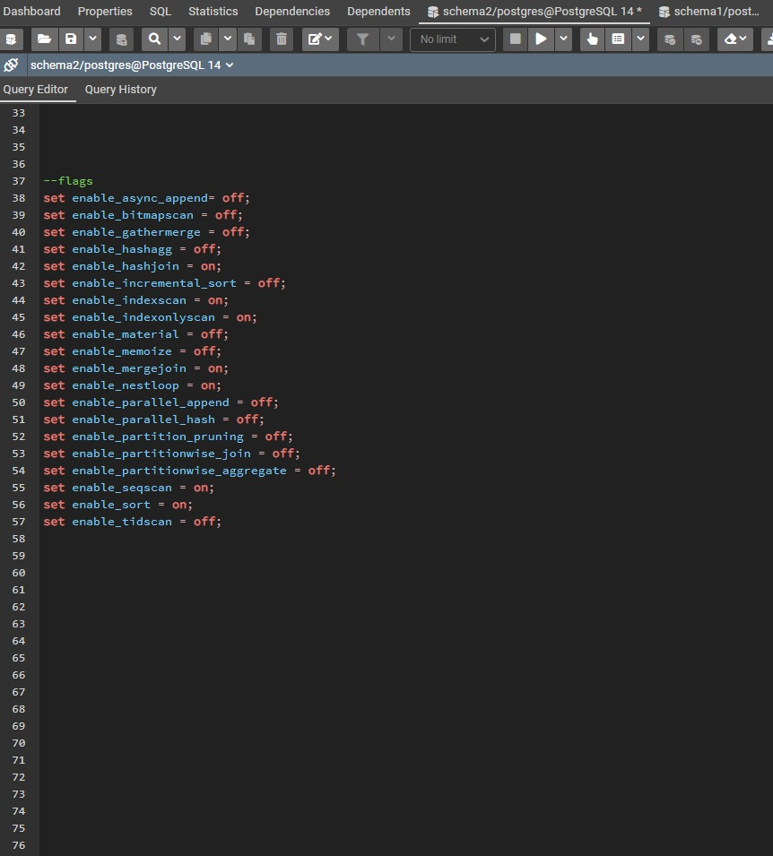

## Query 2


## Note !
### the flags in the screenshot are used in all scenarios of Query 2 except for BRIN index 





### Original Query

```
select distinct pnumber
from project
where pnumber in
(select pnumber
from project, department d, employee e
where e.dno=d.dnumber
and
d.mgr_snn=ssn
and
e.lname='employee1' )
or
pnumber in
(select pno
from works_on, employee
where essn=ssn and lname='employee1' );
```

#### Result Set

- 9200 Rows


#### Report

1. given query without an index :


##### Explanation :

- Metrics :

  | Execution Time : 10.368 ms | Total Expected Cost : 2249.21 |
  | -------------------------- | ----------------------------- |

  
<div style="page-break-after: always; break-after: page;"></div>                                                                                    
2. given query with B+ trees indices only :


##### Explanation :

- Metrics :

  | Execution Time : 9.243 ms | Total Expected Cost : 1259.34 |
  | ------------------------- | ---------------------------- |

  - index created on column lname of table employee
  - performance has been increased as the it's an exact value query (lname="employee1") so the index improve the search to be in O(log(n)) complexity instead of linear search O(n)

  
<div style="page-break-after: always; break-after: page;"></div>

3. given query with hash indices only :


##### Explanation :

- Metrics :

  | Execution Time : 6.833 ms | Total Expected Cost : 1258.77 |
  | ------------------------- | ----------------------------- |

  - index created on column lname of table employee

  - performance has been increased as the it's an exact value query (lname="employee1") so the index improve the search to be in O(1) complexity instead of linear search O(n).

  - Hash index is the best between all other indecies as it Hash the key in Hash tables and get it in O(1) time.


<div style="page-break-after: always; break-after: page;"></div>

4. given query with BRIN indices only :


##### Explanation :

- Metrics :

  | Execution Time : 11.763 ms | Total Expected Cost : 40000002218.12 |
  | --------------------------- | -------------------------------- |

- Here the BRIN was not used in the original Query Plan settings so I've made seqscan=off .

- The Execution Time and Expected Cost became the Worst of all .

- This happened because the Query Optimizer didnt used it from the first place due to BRIN Usage here was not suitable so we have used it to simulate seqscan behaviour only we traveresed it all and followed all its pointers so it is worst index to use in this case.


<div style="page-break-after: always; break-after: page;"></div>


5. given query with mixed indices (any mix of your choice) :


##### Explanation :

- Metrics :

  | Execution Time : 5.876 ms | Total Expected Cost : 1090.56 |
  | ------------------------- | ---------------------------- |

- we made a Hash based index on column lname of table employee
- we made a B+ tree index on column essn of table works_on
-  performance has been increased as the it's an exact value query (lname="employee1") so the Hash index improve the search to be in O(1) complexity instead of linear search O(n).
- B+ index also improved the performance as it's an exact value query (essn=ssn) so the search improved to be performed in O(log(n)) time instead of linear search O(n)


<div style="page-break-after: always; break-after: page;"></div>

## note!
### all flags settings are included in the scenarios screenshots.
### Optimized Query

```
explain analyze
select distinct pnumber
from project
where pnumber in
(select pnumber
from project p1 inner join department d on p1.dnumber=d.dnumber
 	inner join employee e on e.ssn=d.mgr_snn
where e.lname='employee1')
Union
(select pno
from works_on inner join employee on essn=ssn
where lname='employee1' )

```

#### Result Set

- 1055 Rows


<div style="page-break-after: always; break-after: page;"></div>

### Report

1. given query without an index :


##### Explanation :
- we substituted the cartesian product of the inner query to be an inner join so the perfomance has been improved
- we also substituted OR with UNION
- and we removed (in) from the second inner query as it became redundant after writing union instead of

- Metrics :

  | Execution Time : 9.138 ms | Total Expected Cost : 1615.26 |
  | ------------------------- | ----------------------------- |

  <div style="page-break-after: always; break-after: page;"></div>

2. given query with B+ trees indices only :


##### Explanation :
- index created on column lname of table employee
- performance has been increased as the it's an exact value query (lname="employee1") so the index improve the search to be in O(log(n)) complexity instead of linear search O(n)

- Metrics :

  | Execution Time : 4.219 ms | Total Expected Cost : 704.58 |
  | ------------------------- | --------------------------- |


<div style="page-break-after: always; break-after: page;"></div>

3. given query with hash indices only :


##### Explanation :

- Metrics :

  | Execution Time : 3.734 ms | Total Expected Cost : 704.01 |
  | -------------------------- | ---------------------------- |

- index created on column lname of table employee

- performance has been increased as the it's an exact value query (lname="employee1") so the index improve the search to be in O(1) complexity instead of linear search O(n).

- Hash index is the best between all other indecies as it Hash the key in Hash tables and get it in O(1) time.

<div style="page-break-after: always; break-after: page;"></div>

4. given query with BRIN indices only :


##### Explanation :

- Metrics :

  | Execution Time : 6.016 ms | Total Expected Cost : 1595.63 |
  | ------------------------ | ------------------------------------ |

- index created on column lname of table employee
- BRIN index improved the performance compared to the same query with no indecies but the it was a little improvement as it's an exact value query and BRIN is not optimal with that type of queries compared to Hash and B+ indecies

<div style="page-break-after: always; break-after: page;"></div>

5. given query with mixed indices (any mix of your choice) :


##### Explanation :

- Metrics :

  | Execution Time : 3.245 ms | Total Expected Cost : 535.80 |
  | ------------------------- | --------------------------- |

- we made a Hash based index on column lname of table employee
- we made a B+ tree index on column essn of table works_on
-  performance has been increased as the it's an exact value query (lname="employee1") so the Hash index improve the search to be in O(1) complexity instead of linear search O(n).
- B+ index also improved the performance as it's an exact value query (essn=ssn) so the search improved to be performed in O(log(n)) time instead of linear search O(n)